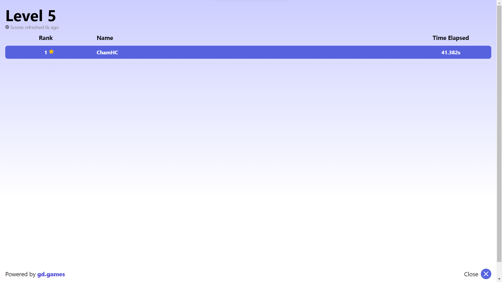

# Wait, I'm An Option?

[Game Maker's Toolkit (GMTK) Game Jam 2023 Entry]

## Description
In 'Wait, I'm An Option?', prepare for an unconventional gaming experience that turns the tables on traditional roles. Step into the shoes of the settings and options themselves, as you assist a hapless protagonist—an AI-controlled bot—through a challenging 2D platformer.

Customize and control the game's key bindings, sound volume, music volume, and time scale to influence the game environment and aid the bot's journey. It's a quirky and imaginative concept that will have you chuckling at the sheer absurdity of being the settings and options.

Traverse through intricate levels, overcome obstacles, and avoid patrols, all while using your unique perspective to optimize the bot's movements. Experiment with different configurations, adjust settings, and find the perfect balance to propel the bot towards its goal.

## Installation
To play 'Wait, I'm An Option?', simply visit the following links:
- [itch.io](https://chamhc.itch.io/wait-im-an-option)
- [gd.games](https://gd.games/chamhc/wait--i-m-an-option-?leaderboardId=cc805610-4851-4c50-aa19-5777852a0439)

No installation is required as the game is accessible directly through your web browser.

## Gameplay
The game will randomly hold down a key for 30 seconds. You, as the player, need to bind the active key to the action you want the AI-controlled bot to perform (e.g., move left, move right, sprint, jump, crouch, dash, etc.). Additionally, you have control over the volume settings and time scale of the game, which will affect the environment and mechanics.

## Controls
In 'Wait, I'm An Option?', there are no specific controls as the entire game revolves around key binding and controlling settings.

## Features
- Engage in a role-reversal gaming experience where you control the settings and options instead of the character.
- Customize key bindings, sound volume, music volume, and time scale to influence the game environment.
- Overcome obstacles and avoid patrols to help the AI-controlled bot navigate challenging levels.
- Compete on the leaderboard by achieving the fastest elapsed time in completing a level.

## Development
'Wait, I'm An Option?' is the developer's first-ever game jam entry. It was created as part of the Game Maker's Toolkit (GMTK) Game Jam 2023.

## Contributing
This repository is intended solely for tracking the released game, and no further updates or contributions are planned.

## License
'Wait, I'm An Option?' is released under the [CC0 1.0 Universal (CC0 1.0) Public Domain Dedication](https://creativecommons.org/publicdomain/zero/1.0/) license.

